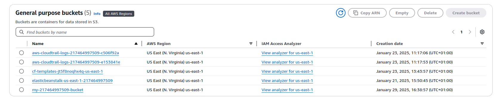
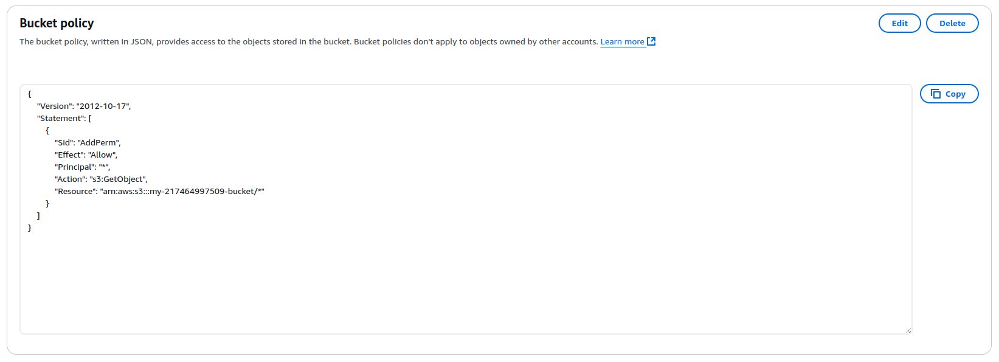
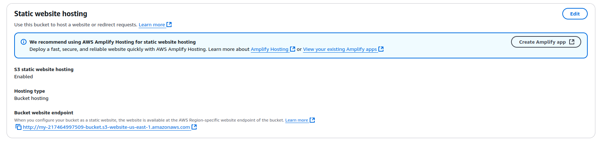
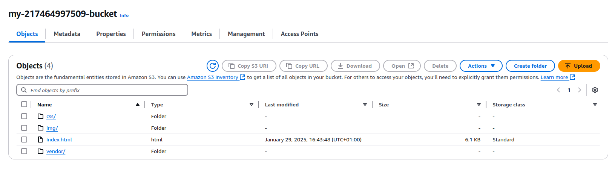
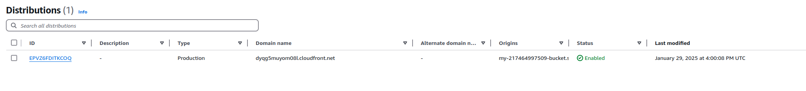

# Project 1 - Deploy Static Website on AWS

## Endpoints
* **S3 Bucket**: http://my-217464997509-bucket.s3-website-us-east-1.amazonaws.com
* **CloudFront**: dyqg5muyom08l.cloudfront.net

## S3 Bucket:

## S3 Policy:

## S3 Static Website:

## S3 Content:

## CloudFront Distribution:

