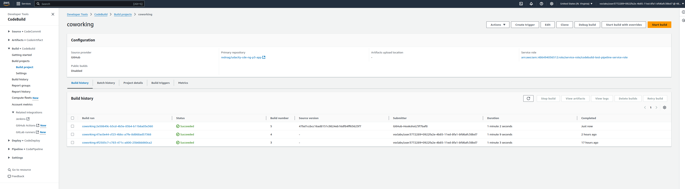
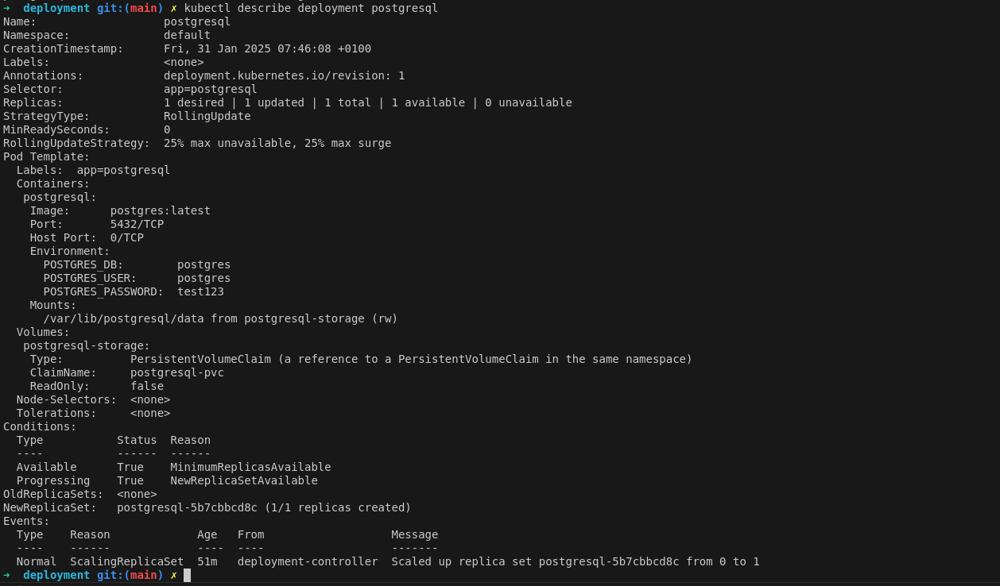

# Coworking Space Service Extension
The Coworking Space Service is a set of APIs that enables users to request one-time tokens and administrators to authorize access to a coworking space. This service follows a microservice pattern and the APIs are split into distinct services that can be deployed and managed independently of one another.

For this project, you are a DevOps engineer who will be collaborating with a team that is building an API for business analysts. The API provides business analysts basic analytics data on user activity in the service. The application they provide you functions as expected locally and you are expected to help build a pipeline to deploy it in Kubernetes.

## Getting Started

### Dependencies
#### Local Environment
1. Python Environment - run Python 3.6+ applications and install Python dependencies via `pip`
2. Docker CLI - build and run Docker images locally
3. `kubectl` - run commands against a Kubernetes cluster
4. `helm` - apply Helm Charts to a Kubernetes cluster

#### Remote Resources
1. AWS CodeBuild - build Docker images remotely
2. AWS ECR - host Docker images
3. Kubernetes Environment with AWS EKS - run applications in k8s
4. AWS CloudWatch - monitor activity and logs in EKS
5. GitHub - pull and clone code

### Setup
#### 1. Configure a Database
Set up a Postgres database using a Helm Chart.

1. Set up Bitnami Repo
```bash
helm repo add <REPO_NAME> https://charts.bitnami.com/bitnami
```

2. Install PostgreSQL Helm Chart
```
helm install <SERVICE_NAME> <REPO_NAME>/postgresql
```

This should set up a Postgre deployment at `<SERVICE_NAME>-postgresql.default.svc.cluster.local` in your Kubernetes cluster. You can verify it by running `kubectl svc`

By default, it will create a username `postgres`. The password can be retrieved with the following command:
```bash
export POSTGRES_PASSWORD=$(kubectl get secret --namespace default <SERVICE_NAME>-postgresql -o jsonpath="{.data.postgres-password}" | base64 -d)

echo $POSTGRES_PASSWORD
```

<sup><sub>* The instructions are adapted from [Bitnami's PostgreSQL Helm Chart](https://artifacthub.io/packages/helm/bitnami/postgresql).</sub></sup>

3. Test Database Connection
The database is accessible within the cluster. This means that when you will have some issues connecting to it via your local environment. You can either connect to a pod that has access to the cluster _or_ connect remotely via [`Port Forwarding`](https://kubernetes.io/docs/tasks/access-application-cluster/port-forward-access-application-cluster/)

* Connecting Via Port Forwarding
```bash
kubectl port-forward --namespace default svc/<SERVICE_NAME>-postgresql 5432:5432 &
    PGPASSWORD="$POSTGRES_PASSWORD" psql --host 127.0.0.1 -U postgres -d postgres -p 5432
```

* Connecting Via a Pod
```bash
kubectl exec -it <POD_NAME> bash
PGPASSWORD="<PASSWORD HERE>" psql postgres://postgres@<SERVICE_NAME>:5432/postgres -c <COMMAND_HERE>
```

4. Run Seed Files
We will need to run the seed files in `db/` in order to create the tables and populate them with data.

```bash
kubectl port-forward --namespace default svc/<SERVICE_NAME>-postgresql 5432:5432 &
    PGPASSWORD="$POSTGRES_PASSWORD" psql --host 127.0.0.1 -U postgres -d postgres -p 5432 < <FILE_NAME.sql>
```

### 2. Running the Analytics Application Locally
In the `analytics/` directory:

1. Install dependencies
```bash
apt update -y
apt install -y build-essential libpq-dev

# Dependencies are installed during build time in the container itself so we don't have OS mismatch
pip install --upgrade pip setuptools wheel --trusted-host pypi.org --trusted-host pypi.python.org --trusted-host=files.pythonhosted.org
pip install -r requirements.txt --trusted-host pypi.org --trusted-host pypi.python.org --trusted-host=files.pythonhosted.org
```
2. Run the application (see below regarding environment variables)
```bash
<ENV_VARS> python app.py
```

There are multiple ways to set environment variables in a command. They can be set per session by running `export KEY=VAL` in the command line or they can be prepended into your command.

* `DB_USERNAME`
* `DB_PASSWORD`
* `DB_HOST` (defaults to `127.0.0.1`)
* `DB_PORT` (defaults to `5432`)
* `DB_NAME` (defaults to `postgres`)

If we set the environment variables by prepending them, it would look like the following:
```bash
DB_USERNAME=username_here DB_PASSWORD=password_here python app.py
```
The benefit here is that it's explicitly set. However, note that the `DB_PASSWORD` value is now recorded in the session's history in plaintext. There are several ways to work around this including setting environment variables in a file and sourcing them in a terminal session.

3. Verifying The Application
* Generate report for check-ins grouped by dates
`curl <BASE_URL>/api/reports/daily_usage`
* Expected output should look like
```json
{"2023-02-07":40,"2023-02-08":202,"2023-02-09":179,"2023-02-10":158,"2023-02-11":146,"2023-02-12":176,"2023-02-13":196,"2023-02-14":142}
```

* Generate report for check-ins grouped by users
`curl <BASE_URL>/api/reports/user_visits`
* Expected output should look like
```json
{"1":{"joined_at":"2023-01-20 03:23:39.757813","visits":6},"2":{"joined_at":"2023-02-02 16:23:39.757830","visits":5},"3":{"joined_at":"2023-01-31 10:23:39.757836","visits":5},"4":{"joined_at":"2023-02-13 05:23:39.757840","visits":2},"5":{"joined_at":"2023-02-11 22:23:39.757844","visits":7},"6":{"joined_at":"2023-02-07 18:23:39.757848","visits":3}}
```

### 3. Building the Docker Image
The build process is automated using AWS CodeBuild. The `buildspec.yml` file contains the build instructions for the Docker image. The build process is triggered by any push to the `main` branch in a separated GitHub repository - `https://github.com/rednag/udacity-cde-ng-p3-app`.

```yaml
version: 0.2

phases:
  pre_build:
    commands:
      - echo Logging into ECR
      - aws ecr get-login-password --region $AWS_DEFAULT_REGION | docker login --username AWS --password-stdin $AWS_ACCOUNT_ID.dkr.ecr.$AWS_DEFAULT_REGION.amazonaws.com
  build:
    commands:
      - echo Starting build at `date`
      - echo Building the Docker image...          
      - docker build -t $IMAGE_REPO_NAME:$CODEBUILD_BUILD_NUMBER .
      - docker tag $IMAGE_REPO_NAME:$CODEBUILD_BUILD_NUMBER $AWS_ACCOUNT_ID.dkr.ecr.$AWS_DEFAULT_REGION.amazonaws.com/$IMAGE_REPO_NAME:$CODEBUILD_BUILD_NUMBER      
  post_build:
    commands:
      - echo Completed build at `date`
      - echo Pushing the Docker image...
      - docker push $AWS_ACCOUNT_ID.dkr.ecr.$AWS_DEFAULT_REGION.amazonaws.com/$IMAGE_REPO_NAME:$CODEBUILD_BUILD_NUMBER
```


### 4. Deploying the Application
The application is deployed using Kubernetes. The deployment configuration is stored in the `deployment/` directory. The deployment configuration is split into 

* configmap.yaml - contains the environment variables for the application
* coworking-service.yaml - contains the service configuration
* coworking.yaml - contains the deployment configuration
* postgres-service.yaml - contains the service configuration for the Postgres database
* postgres.yaml - contains the deployment configuration for the Postgres database
* pv.yaml - contains the persistent volume configuration
* pvc.yaml - contains the persistent volume claim configuration

The deployment can be applied using the following command:
```bash
kubectl apply -f deployment/
```

### 5. Monitoring the Application
The application logs can be monitored using AWS CloudWatch. The logs are stored in the `/aws/containerinsights/my-cluster/application` log group. The log group can be found in the AWS Console under CloudWatch.

### 6. Troubleshooting
If you encounter any issues, please refer to the following resources:
* [Kubernetes Documentation](https://kubernetes.io/docs/home/)
* [Docker Documentation](https://docs.docker.com/)
* [AWS Documentation](https://docs.aws.amazon.com/)

If you are unable to resolve the issue, please reach out to the DevOps team for assistance.

### 7. Additional Commands
In this section all relevant commands for the deployment are listed:

```bash
kubectl apply -f <FILE_NAME>
kubectl delete -f <FILE_NAME>
kubectl logs <POD_NAME>
kubectl describe <deployment|service> <POD_NAME>
kubectl get pods
kubectl get svc
kubectl cp <source_file> <destination_file>
kubectl port-forward svc/<SERVICE_NAME>-postgresql 5432:5432 &
kubectl exec --stdin --tty <POD_NAME> -- bash
kubectl get secret db-secret -o jsonpath="{.data.DB_PASSWORD}" | base64 -d
```

## Project Submission

### Deliverables
1. `Dockerfile`
<br>

```Dockerfile
FROM python:3.10-slim-buster

USER root

WORKDIR /src

COPY ./requirements.txt requirements.txt

# Dependencies required for psycopg2 (used for Postgres client)
RUN apt update -y && apt install -y build-essential libpq-dev

# Dependencies are installed during build time in the container itself so we don't have OS mismatch
RUN pip install --upgrade pip setuptools wheel --trusted-host pypi.org --trusted-host pypi.python.org --trusted-host=files.pythonhosted.org
RUN pip install -r requirements.txt --trusted-host pypi.org --trusted-host pypi.python.org --trusted-host=files.pythonhosted.org

COPY . .

CMD python app.py
```

<br>

2. Screenshot of AWS CodeBuild pipeline
*See section screenshots or directory `screenshots/` for the screenshots.*

3. Screenshot of AWS ECR repository for the application's repository
*See section screenshots or directory `screenshots/` for the screenshots.*

4. Screenshot of `kubectl get svc`
*See section screenshots or directory `screenshots/` for the screenshots.*

5. Screenshot of `kubectl get pods`
*See section screenshots or directory `screenshots/` for the screenshots.*

6. Screenshot of `kubectl describe svc <DATABASE_SERVICE_NAME>`
*See section screenshots or directory `screenshots/` for the screenshots.*

7. Screenshot of `kubectl describe deployment <SERVICE_NAME>`
*See section screenshots or directory `screenshots/` for the screenshots.*

8. All Kubernetes config files used for deployment (ie YAML files)
<br>

`configmap.yaml`
`coworking-service.yaml`
`coworking.yaml`
`postgres-service.yaml`
`postgres.yaml`
`pv.yaml`
`pvc.yaml`
<br>

9. Screenshot of AWS CloudWatch logs for the application
*See section screenshots or directory `screenshots/` for the screenshots.*


### Stand Out Suggestions
Please provide up to 3 sentences for each suggestion. Additional content in your submission from the standout suggestions do _not_ impact the length of your total submission.
1. Specify reasonable Memory and CPU allocation in the Kubernetes deployment configuration
*Since we are talking about a simple application with a few endpoints and no expected heavy load I'd run it on a pretty small resource and if needed it can be easily changed in the deployment file, same could be done for the datebase.*
2. In your README, specify what AWS instance type would be best used for the application? Why?
*For the EKS I've chosen t3.small for such an application this is a sufficient instance type, it has 2 vCPUs and 2GB of memory, which is more than enough for the application and the database. If needed it can be easily scaled up.*
3. In your README, provide your thoughts on how we can save on costs?
*Here we have already chosen a pretty small instance type, so the costs are already pretty low, but if we want to save even more we could use spot instances for the EKS cluster, which would save addtional costs. We could also think of choosing more or less nodes to be deployed in the EKS or maybe directly choose Fargate*

### Screenshots

**Screenshot of AWS CodeBuild pipeline**
<br>

<br>

<br>

<br>

<br>


**Screenshot of AWS ECR repository for the application's repository**
<br>

<br>

<br>


**Screenshot of `kubectl get svc`**
<br>

<br>


**Screenshot of `kubectl get pods`**
<br>

<br>


**Screenshot of `kubectl describe svc <DATABASE_SERVICE_NAME>`**
<br>

<br>


**Screenshot of `kubectl describe deployment <SERVICE_NAME>`**
<br>

<br>

<br>


**Screenshot of AWS CloudWatch logs for the application**
<br>

<br>

<br>

<br>